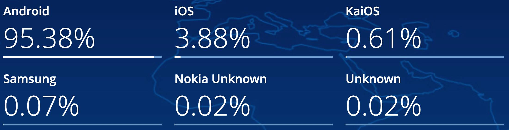

## Android vs iOS

Smartphones have become an essential part of our daily lives, allowing us to stay connected with the world on the go. These devices are essentially small computers that can fit into our pockets. Despite their small size, modern smartphones are incredibly powerful, boasting processing power that rivals that of traditional desktop computers. In fact, it's often said that the average smartphone today has a million times more RAM and seven million times more memory than the guidance computer used for the Apollo 11 mission that [landed the first humans on the moon](https://www.realclearscience.com/articles/2019/07/02/your_mobile_phone_vs_apollo_11s_guidance_computer_111026.html)!

While smartphones have made it possible to access the internet on the go, browsing on a smaller screen with a touch-based interface can still be a challenge. Progressive Web Apps (PWAs) have helped to improve the browsing experience to some extent. However, for a truly optimized experience, nothing beats a well-designed native mobile app that is built from the ground up with a mobile-first approach.

As of 2023, the number of smartphone users worldwide has continued to increase and currently stands at around 4.6 billion people, which translates to over 58% of the global population owning a smartphone. The two major operating systems in the smartphone market are Android and iOS, which continue to dominate the market share. [Android and iOS market share](https://gs.statcounter.com/os-market-share/mobile/worldwide) clearly in the lead.

Note that this is the _global_ stats and vary significantly per country. For instance, the market share for iOS is around 56.8% in the US, 51.6% in the UK, but only 3.88% in India. As a result, which platform you focus most of your energy on should depend on your target audience. It is clear however that if you manage to cover both iOS and Android, you will cover 99% of your audience, no matter the country.

Now, as phones are just tiny computers, they have an operating system, the same way your computer does.

- **Some examples of computers:** MacBook, Dell, Lenovo
- **Some examples of operating systems:** macOS, Windows, Linux
- **Some examples of phones:** iPhone, Samsung Galaxy S20, Nexus 5X
- **Some examples of phone operating systems:** iOS, Android

## The Problem

Applications are designed to run on a particular _operating system_ so you can't just take an iOS app and run it on Android and vice versa. App Store vs Google Play Store aside, the underlying _architecture_ is incompatible.

So in order to target 99% of smartphone users, we'll have to build two apps: one for Android and one for iOS.

It's easy to imagine the difficulties this can cause: you'll have to manage two of everything: language, codebases, developer teams, feature sets, release schedules etc. Hiring two developer teams is expensive, and hiring a single team that has in depth knowledge of both Android and iOS is almost impossible.

## The Solution

React Native is a platform developed by Facebook for solving this problem. Their goal was to build a platform that enables you to have:

- fully native apps (not webviews/PWAs)
- one codebase
- one development team
- one language
- fully extensible (you should be anything that is possible without using React Native)

The language of choice ended up being JavaScript probably because React (the popular frontend framework also developed by Facebook) is a JavaScript framework, so it provides the smallest possible learning curve for folks already familiar with React.

Note: React Native is not the only such framework, and it's not even the first, but where it differs from others is that a built React Native app is indistinguishable from a "real" native app. Unlike most of the other frameworks, it is not just a webview that look like a real app. The other really standout feature is that React Native apps are infinitely extensible: you are not constrained by the framework and you can always pure native code in your app if you want to do something the framework doesn't already enabled. Finally, if you're already familiar to React and web development, then the learning curve for React Native is really not that steep.

## How does it work?

Without getting overly technical here, React Native is built in such a way that it targets existing compilers. For example, we have compilers that accept Java / Kotlin code and target Android platform, or Objective C / Swift targeting iOS platform. This is really powerful, because

1. Native compilers are _designed_ for this, so we'll be no worse than non-React Native apps, and
2. This makes the React Native framework extensible to other native platforms. React Native Windows? VR? Web? It could all be available from our one unified JavaScript API.

Source: https://hackernoon.com/understanding-react-native-bridge-concept-e9526066ddb8
